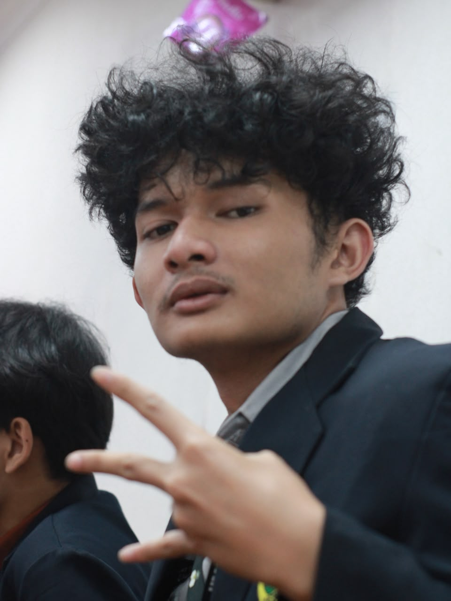

# Portfolio Liquid Glass

Website portfolio personal dengan desain **glassmorphism/liquid glass** yang modern, responsif, dan penuh animasi halus. Dibangun dengan HTML, CSS, dan JavaScript murni (tanpa framework).

## 📸 Preview

| Desktop | Mobile |
|---------|--------|
|  |  |

> **Catatan:** Ganti file gambar di folder `assets/` dengan screenshot aktual portfolio Anda.

## ✨ Fitur Utama

- **Liquid Glass Effect** — Efek kaca cair dengan `backdrop-filter`, SVG filter, dan gradient animasi
- **Theme Toggle** — Mode gelap/terang dengan persistensi `localStorage`
- **Scroll Progress Bar** — Indikator kemajuan scroll di bagian atas
- **Cursor Glow** — Efek cahaya mengikuti kursor (desktop only)
- **Background Orbs** — Blob animasi di background dengan `border-radius` morphing
- **Scroll Reveal** — Animasi masuk elemen saat discroll (IntersectionObserver)
- **Typing Animation** — Efek mengetik pada role di hero section
- **Vanilla Tilt** — Efek 3D tilt pada skill cards (via vanilla-tilt.js)
- **Popup Modal** — Detail tambahan untuk card About (Background, Goal, Organization, Certificate)
- **Fully Responsive** — Mobile-first, breakpoint di 640px & 768px
- **Reduced Motion** — Menghormati preferensi `prefers-reduced-motion`
- **Low-End Mode** — Nonaktifkan efek berat otomatis di Android

## 🛠 Tech Stack

| Kategori | Teknologi |
|----------|-----------|
| Structure | HTML5 (semantic) |
| Styling | CSS3 (Custom Properties, Grid, Flexbox, Animations) |
| Interaksi | Vanilla JavaScript (ES6+) |
| Library | [Vanilla Tilt](https://micku7zu.github.io/vanilla-tilt.js/) (CDN) |
| Icons | Font Awesome 6 (CDN) |
| Font | Inter (system-ui fallback) |

## 📁 Struktur Project

```
portfolio-liquid-glass/
├── index.html          # Entry point
├── style.css           # Semua styling (1200+ baris)
├── script.js           # Logika interaksi (230+ baris)
├── assets/
│   ├── BG.jpg          # Background default (dark)
│   ├── BG2.jpg         # Background alternatif
│   ├── BG3.jpg         # Background hero (dark)
│   ├── BG4.jpg         # Background hero (light)
│   ├── L.jpeg          # Foto profil
│   └── WhatsApp Image 2026-09-18 at 22.51.23.jpeg
└── README.md           # Dokumentasi ini
```

## 🚀 Cara Menjalankan

### Opsi 1: Langsung buka file
```bash
# Cukup double-click index.html atau:
start index.html        # Windows
open index.html         # macOS
xdg-open index.html     # Linux
```

### Opsi 2: Live Server (direkomendasikan)
```bash
# VS Code: Install extension "Live Server" → Right-click index.html → "Open with Live Server"
# Atau via npx:
npx serve .
# Atau Python:
python -m http.server 8000
```

## ⚙️ Kustomisasi

### 1. Ganti Foto Profil
```html
<!-- index.html line 79 -->

```
Ganti file `assets/L.jpeg` dengan foto Anda (rasio 1:1 direkomendasikan).

### 2. Ubah Data Pribadi
Edit di `index.html`:
- **Nama & Role** (line 53, 55)
- **Deskripsi** (line 58)
- **Social Links** (line 67-72)
- **Mini Stats** (line 89-100)
- **About Cards** (line 113-141)
- **Skills** (line 153-199)
- **Projects** (line 211-276)
- **Contact WhatsApp** (line 289)

### 3. Ganti Background
```css
/* style.css line 2-3 */
--bg-main: linear-gradient(...), url(assets/BG3.jpg);

/* style.css line 15 (light mode) */
--bg-main: linear-gradient(...), url(assets/BG4.jpg);
```
Ganti file di `assets/` atau ubah URL ke gambar online.

### 4. Warna Tema
```css
/* style.css line 1-12 (dark) */
:root {
    --accent-1: #22777D;
    --accent-2: #3A9AA0;
    --accent-3: #F1EDEB;
    /* ... */
}

/* style.css line 14-25 (light) */
body.light {
    --accent-1: #1F305E;
    --accent-2: #22777D;
    /* ... */
}
```

### 5. Tambah Project Baru
Duplikasi block `project-card` di `index.html` (line 211-260) dan sesuaikan:
- Tag kategori (WEB, AI/ML, DESKTOP, dll)
- Judul, deskripsi, tech stack
- Link GitHub/demo

### 6. Tambah Gambar ke Popup Modal
```javascript
// script.js line 189-202
const popupData = {
    background: {
        title: "My Background",
        images: [
            "assets/your-image-1.jpg",
            "assets/your-image-2.jpg"
        ]
    },
    // ...
};
```

## 📱 Responsivitas

| Breakpoint | Perilaku |
|------------|----------|
| `> 768px` | Layout grid 3 kolom (skills, projects), hero 2 kolom |
| `640px - 768px` | Skills 2 kolom, projects 1 kolom, hamburger menu aktif |
| `< 640px` | Semua 1 kolom, header compact, font mengecil via `clamp()` |

## ♿ Aksesibilitas

- Semantic HTML5 (`header`, `main`, `section`, `article`, `nav`, `footer`)
- ARIA labels pada tombol & link ikon
- Fokus visible pada elemen interaktif
- Kontras warna memenuhi WCAG AA
- `prefers-reduced-motion` dihormati
- `viewport-fit=cover` & safe-area insets untuk mobile

## 🐛 Known Issues / TODO

- [ ] Popup modal belum memiliki data gambar (array `images` kosong di `script.js`)
- [ ] Project "Muraiku" link masih `#` (placeholder)
- [ ] Font Inter load dari system-ui, belum self-hosted
- [ ] Tidak ada unit test / CI

## 📄 Lisensi

MIT License — bebas digunakan, dimodifikasi, dan didistribusikan.

## 👨‍💻 Author

**Altha Lingga Leksono**  
Mahasiswa Informatika, Universitas Negeri Jember (2026)  
- GitHub: [@ironlad1621G](https://github.com/ironlad1621G/)  
- Instagram: [@azdjgkf](https://www.instagram.com/azdjgkf/)

---

> Dibangun dengan semangat *Experiment Over Theories* 🧪