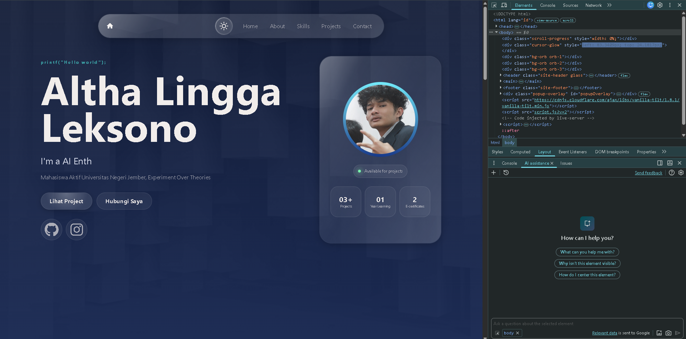
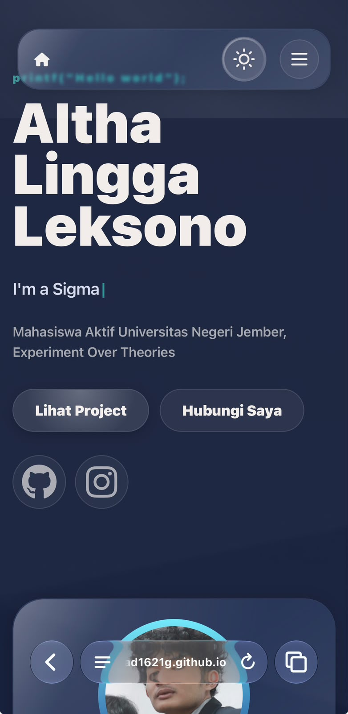

# Portfolio Liquid Glass

Website portfolio personal dengan desain **glassmorphism/liquid glass** yang modern, responsif, dan penuh animasi halus. Dibangun dengan HTML, CSS, dan JavaScript murni (tanpa framework).

 📸 Preview

| Desktop | Mobile |
|---------|--------|
|  |  |


 ✨ Fitur Utama

- **Liquid Glass Effect** — Efek kaca cair dengan `backdrop-filter`, SVG filter, dan gradient animasi
- **Theme Toggle** — Mode gelap/terang dengan persistensi `localStorage`
- **Scroll Progress Bar** — Indikator kemajuan scroll di bagian atas
- **Cursor Glow** — Efek cahaya mengikuti kursor (desktop only)
- **Background Orbs** — Blob animasi di background dengan `border-radius` morphing
- **Scroll Reveal** — Animasi masuk elemen saat discroll (IntersectionObserver)
- **Typing Animation** — Efek mengetik pada role di hero section
- **Vanilla Tilt** — Efek 3D tilt pada skill cards (via vanilla-tilt.js)
- **Popup Modal** — Detail tambahan untuk card About (Background, Goal, Organization, Certificate)
- **Fully Responsive** — Mobile-first, breakpoint di 640px & 768px
- **Reduced Motion** — Menghormati preferensi `prefers-reduced-motion`
- **Low-End Mode** — Nonaktifkan efek berat otomatis di Android

## 🛠 Tech Stack

| Kategori | Teknologi |
|----------|-----------|
| Structure | HTML5 (semantic) |
| Styling | CSS3 (Custom Properties, Grid, Flexbox, Animations) |
| Interaksi | Vanilla JavaScript (ES6+) |
| Library | [Vanilla Tilt](https://micku7zu.github.io/vanilla-tilt.js/) (CDN) |
| Icons | Font Awesome 6 (CDN) |
| Font | Inter (system-ui fallback) |

## 📁 Struktur Project

```
portfolio-liquid-glass/
├── index.html          # Entry point
├── style.css           # Semua styling (1200+ baris)
├── script.js           # Logika interaksi (230+ baris)
├── assets/
│   ├── BG.jpg          # Background default (dark)
│   ├── BG2.jpg         # Background alternatif
│   ├── BG3.jpg         # Background hero (dark)
│   ├── BG4.jpg         # Background hero (light)
│   ├── L.jpeg          # Foto profil
│   └── WhatsApp Image 2026-09-18 at 22.51.23.jpeg
└── README.md           # Dokumentasi ini
```


## 👨‍💻 Author

**Altha Lingga Leksono**  
Mahasiswa Informatika, Universitas Negeri Jember (2026)  
- GitHub: [@ironlad1621G](https://github.com/ironlad1621G/)  
- Instagram: [@azdjgkf](https://www.instagram.com/azdjgkf/)

---

